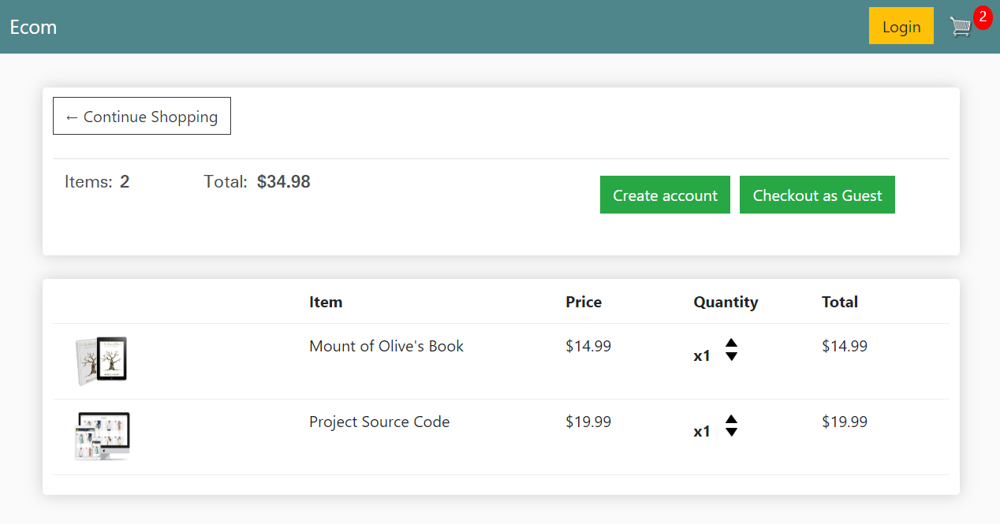
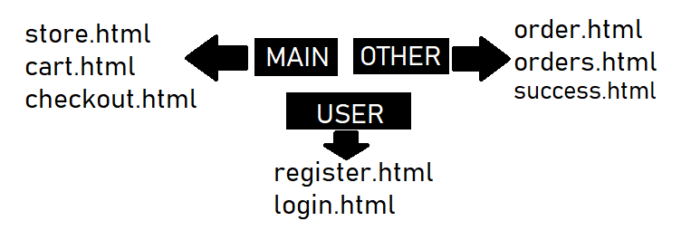
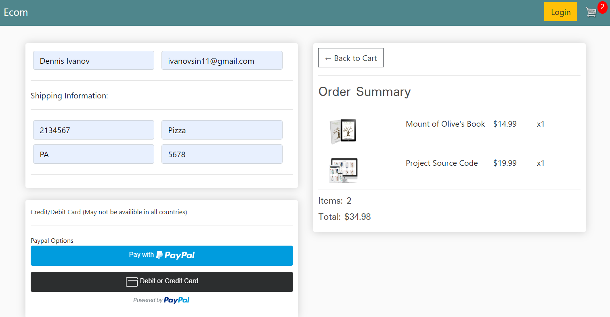

# Project Overview

We will start first by setting up our templates and data structure in the first two modules, then moving on to adding user checkout flow with payment integration.

After we complete basic checkout with a logged in user, we will add in the ability for users to checkout as a guest using cookies.

## What We Are Building

### 1. Home Page:

This product will be a fully functioning eCommerce website from start to checkout functionality. Users will have the ability to add multiple products to cart, varying from physical to digital products.

**Payment Integration:**

Payment integration will be handled with PayPal offering the ability to checkout with a PayPal account and checkout with PayPal debit/credit card. Stripe integration is simple to add but for the purpose of international transactions we will focus on PayPal for international availability and security.

**Cart:**

### 2. User/Guest Checkout

The main focus of this eCommerce project will be to integrate guest checkout ability along with user accounts. Many eCommerce tutorials/demo’s have one or the other but I could not find any at this time that contain both.

As I posted on twitter in April 2020 “A good eCommerce website should always give the user the ability to checkout without creating an account.“

This kind of functionality has come to be expected by users and forcing them to create an account can affect sales significantly as any resistance does.

#### Authenticated User Vs Guest Checkout

Authenticated users & guests have virtually the same process with slight differences. Users with accounts will have the ability to view pending and previous orders while guests will have items stored in cookies and will have the option to create account after a successful purchase.

**Authenticated User Process:**

1. Add item to cart → Edit Order → Checkout
2. View pending and previous orders + Order details 

**Guest Checkout Process:**

1. Add item to cart → Edit Order → Checkout
2. Create Account to view Order

### 3. Project Structure

Before we start building, let's go over the core structure of this project. I’ll first go over templates and what each one will handle and then we’ll cover our models and page functionality.  

#### Templates

This project will focus on 3 main templates, `store.html`, `cart.html` and `checkout.html`.

| store.html                     | cart.html                     | checkout.html                     |
| ------------------------------ | ----------------------------- | --------------------------------- |
|  |  |  |

### 4. Models

This project will consist of 6 Models, so let's summarize each one:

1. USER - Built in Django user model,  instance created for each customer who registers.
2. CUSTOMER - Along with a User model, each customer will contain a Customer model that holds a one to one relationship to each user. (OneToOneField)
3. PRODUCT - The product model represents product types we have in store.
4. ORDER - The order model will represent a transaction that is placed or pending. The model will hold information such as the transaction ID, data completed and order status. This model will be a child or the customer model but a parent to Order Items.
5. ORDER_ITEM - An order Item is one item with an order. For example, a shopping cart may consist of many items but is all part of one order. Therefore the OrderItem model will be a child of the PRODUCT model AND the ORDER Model.
6. SHIPPING - Not every order will need shipping information. For orders containing physical products that need to be shipping we will need to create an instance of the shipping model to know where to send the order. Shipping will simply be a child of the order model when necessary.

### 4. Paypal Setups Refer

- [Paypal Developer](https://developer.paypal.com/developer/applications/) or https://developer.paypal.com/dashboard create your account with actual email and password.
  - It is used to manage your apps and credentials, testing (creating you temporary sandbox account).
- [Paypal Buttons](https://developer.paypal.com/demo/checkout/#/pattern/server)
- [Sandbox Account](https://www.sandbox.paypal.com/us/home) which is used for testing (temporary account).

***Note:*** You might not get the paypal button on actual hosted website because of you need SSL certificate. But you can test it on localhost.

**Error:**
>We’re sorry. This seller doesn’t accept payments in your currency. Please return to the seller and choose another way to pay.

**Solution:** https://stackoverflow.com/a/77824452/19953363
